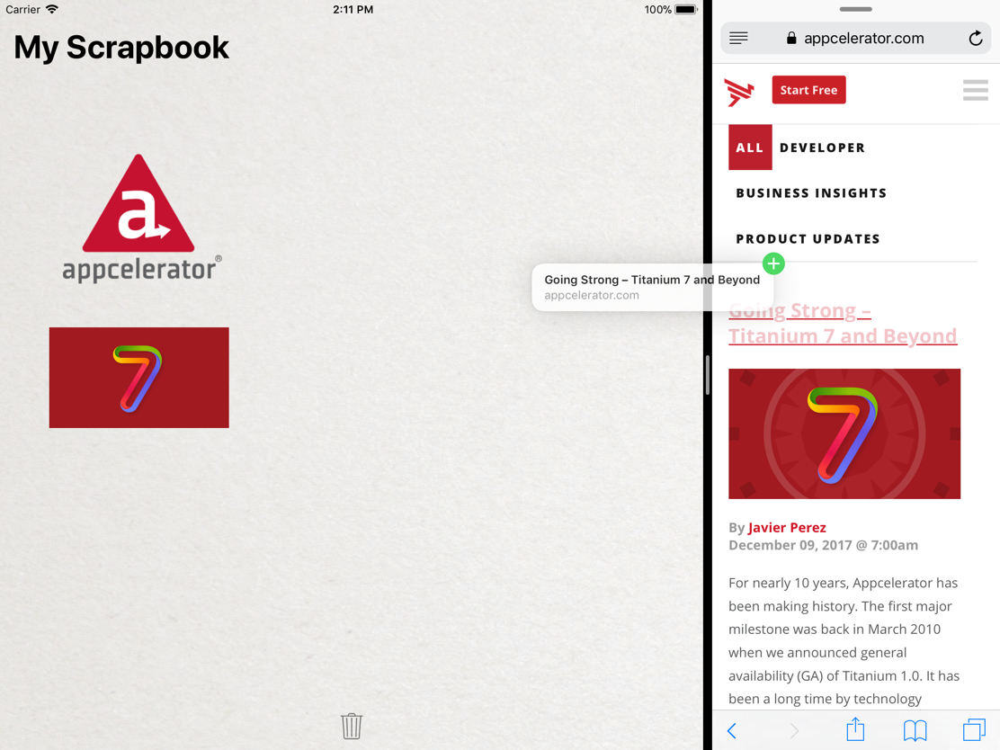

# Drag 'n Drop

Appcelerator Titanium sample app demonstrating the drag-and-drop APIs exposed in iOS 11. **Note: Inter-app drag-and-drop is currently restricted to iPad only.**

## Requirements

This project requires Xcode 9 with iOS 11 SDK and Titanium 7.0.0.

### Import the project

* Studio: File > Import... > Git > Git Repository as New Project
* CLI: Clone the repo then move to the project directory and run

        appc new --import --no-services

### Dependencies

The Ti.DragDrop native module is required and included in the project. The module project is available here: https://github.com/appcelerator-modules/ti.dragdrop

## Legal

Appcelerator, Appcelerator Titanium and associated marks and logos are
trademarks of Appcelerator, Inc.

Titanium is Copyright (c) 2008-present by Appcelerator, Inc. All Rights Reserved.

Titanium is licensed under the Apache Public License (Version 2). Please
see the LICENSE file for the full license.
